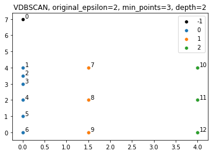

# VariousDBSCAN, a variant of DBSCAN to identify clusters with various densities

## Idea

The approach was born from a personal project I was working on. I had some texts to regroup but as I didn't know the number of clusters to expect, using DBSCAN was at first the best approach I could come with.

I was using the number of common words (or tokens) as a similarity measure to perform the clustering. The problem I faced is that I could identify clusters with 4 or more common words but within that there was for example one strong subgroup with 6 or more common words.

With the original DBSCAN approach I could not separate such a subgroup without losing the original group of 4 or more common words.

This is why I implemented this approach which finds strong "subclusters" within precomputed clusters.
## Method

1. We first run a usual DBSCAN on all our data, with a provided epsilon and min_points value.
2. Once we found clusters, we update the epsilon value to make it smaller.
3. For each new found cluster, we run again DBSCAN with our updated epsilon value and the same min_points value.
4. We sort all the clusters in a tree in which each node contains a sample of points and its children nodes contain the sample points for each cluster identified.
5. We stop when DBSCAN finds no new clusters within all previous clusters.
6. Finally, we remove from each cluster points that appear in one of the descendants of its node (points that belong to a "stronger" cluster) so that each point only belongs to one cluster, and we remove resulting clusters that have less than min_points points inside them.

## Usage
``` python
import numpy as np
from scipy.spatial import distance_matrix
from variousDBSCAN import VariousDBSCAN

np.random.seed(42)
points = np.random.random((1000, 42))
distances = distance_matrix(points, points)
vDBSCAN = VariousDBSCAN(distances, original_epsilon=1.8, min_points=5)
clusters = vDBSCAN.fit()
print(clusters)
```

```python
[[35, 931, 904, 492, 915, 500], [774, 237, 849, 117, 348, 958], [832, 353, 961, 265, 777, 144, 537], [923, 684, 176, 661, 662, 216, 411, 124, 991], [739, 939, 566, 926, 287], [224, 868, 683, 478, 255], [294, 966, 882, 691, 924, 61]]
```
## Example

- Iteration 1:


Resulting clusters tree:
<pre>
├── 0 [1, 2, 3, 4, 5, 6, 7, 8, 9]
└── 1 [10, 11, 12]
</pre>

- Iteration 2:



Resulting clusters tree:
<pre>
├── 0 [7, 8, 9] 
│   └── 0 [1, 2, 3, 4, 5, 6]
└── 1 [10, 11, 12]
</pre>
- Iteration 3:


Resulting clusters tree:
<pre>
├── 0 [7, 8, 9]
│   └── 0 [4, 5, 6]
│       └── 0 [1, 2, 3]
└── 1 [10, 11, 12]
</pre>
## Note
- Any contribution to improve performance and adding more parameters is welcome.
- Any help to export it as a PyPI index is also welcome.
- This was originally just something personal done on my free time after graduating in Data Science, so documentation and code is far from perfect.

## Licence

See [LICENSE.md](LICENSE). 
